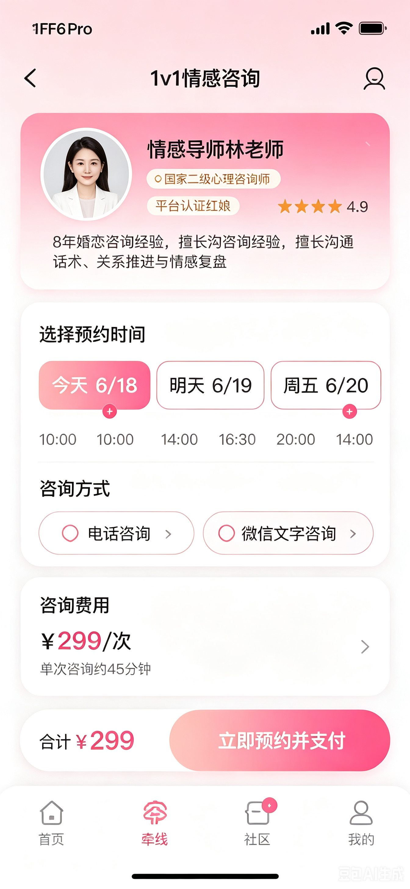

# 1v1情感咨询

- **所属模块**：模块四：牵线模块
- **来源文件**：`宣誓爱终极版.xmind`
- **节点路径**：婚恋小程序产品功能思维导图（模块一未完成） > 模块四：牵线模块 > 1v1情感咨询
- **子节点数**：1
- **子树截图数**：1

> 说明：下方按思维导图原有层级展开。带截图的节点会先展示图片，再列出该图之后挂接的要求/改动。

## 页面内容（截图 + 要求/改动）

- **界面截图 1**
  
  

  - 页面组成
    - 红娘信息
    - 预约日期
    - 预约时间
    - 咨询方式
    - 服务费用
  - 页面交互
    - 日期选择
    - 时间选择
    - 在线支付
  - 服务流程
    - 选择红娘
    - 预约时间
    - 提交订单
    - 在线支付
    - 红娘联系

## 资源

本页导出图片 1 张，目录：`images/`

- `01-screen-01.png`
