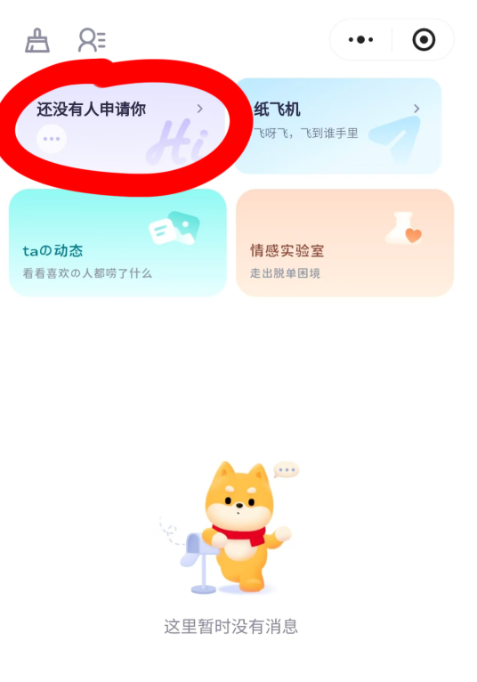
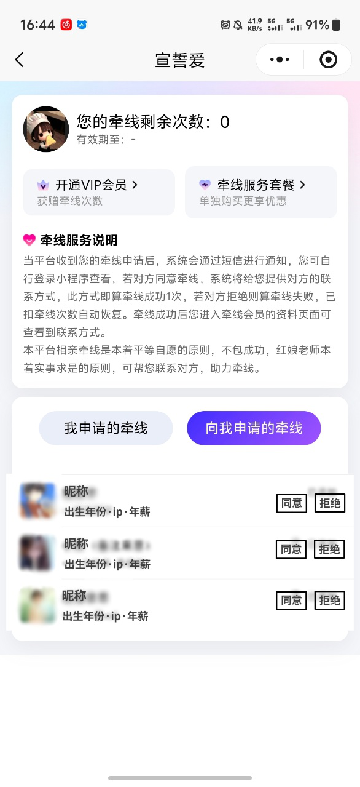
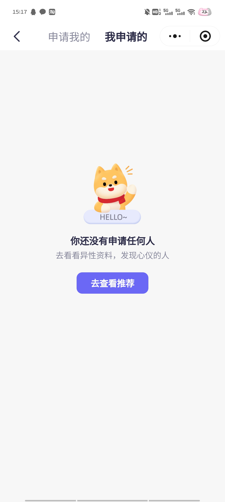
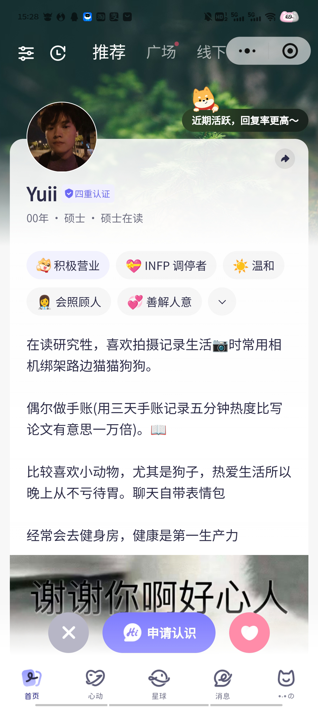
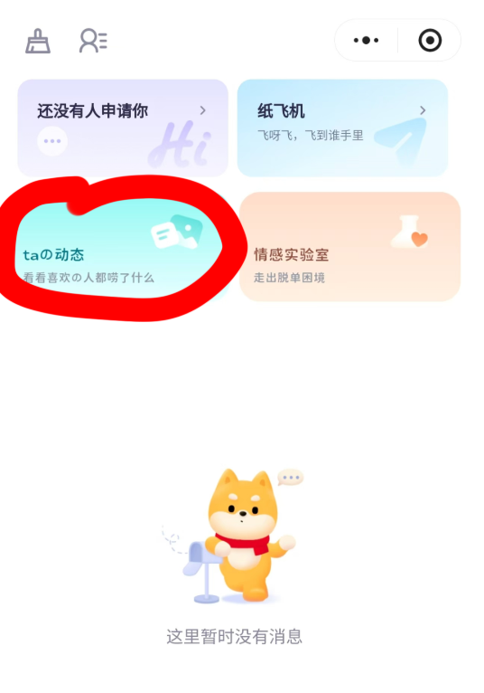
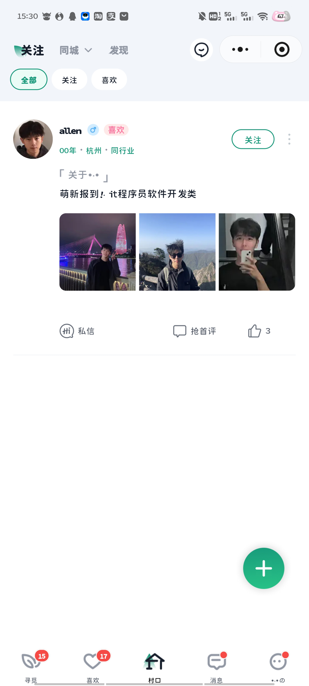

# 消息通知

- **所属模块**：模块三：社交互动与消息
- **来源文件**：`宣誓爱终极版.xmind`
- **节点路径**：婚恋小程序产品功能思维导图（模块一未完成） > 模块三：社交互动与消息 > 消息通知
- **子节点数**：2
- **子树截图数**：9

> 说明：下方按思维导图原有层级展开。带截图的节点会先展示图片，再列出该图之后挂接的要求/改动。

## 页面内容（截图 + 要求/改动）

- ”申请认识“
  - **界面截图 1**（如图）
    
    

    - 图注/节点名：如图
    - **界面截图 2**（点开后分为”申请我的“和”我的申请“双tab切换）
      
      

      - 图注/节点名：点开后分为”申请我的“和”我的申请“双tab切换
      - 申请我的
        - **界面截图 3**（场景一：没有收到申请）
          
          

          - 图注/节点名：场景一：没有收到申请
        - **界面截图 4**（场景二：收到申请 大致如图（头像不用模糊，显示对方头像+昵称，出生年份，ip，年薪）每个人旁边加上选项”同意/拒绝“）
          
          

          - 图注/节点名：场景二：收到申请 大致如图（头像不用模糊，显示对方头像+昵称，出生年份，ip，年薪）每个人旁边加上选项”同意/拒绝“
          - 同意申请后，跳转到和对方的聊天页面，系统自动发送“你好呀，我们可以开始聊天了~”。同时在”申请我的“页面删除对方的申请信息，对方的通知页面显示“对方已同意” `改动/要求`
          - 拒绝申请后，对方的申请认识次数+1，同时在”申请我的“页面删除对方的申请信息，对方的通知页面显示“对方已拒绝” `改动/要求`
      - 我的申请
        - **界面截图 5**（场景一：没有申请任何人）
          
          

          - 图注/节点名：场景一：没有申请任何人
          - **界面截图 6**（点击“去查看推荐”跳转到"首页推荐"）
            
            

            - 图注/节点名：点击“去查看推荐”跳转到"首页推荐"
        - **界面截图 7**（场景二：申请了其他人 大致如图（头像不用模糊，显示对方头像+昵称，出生年份，ip，年薪））
          
          

          - 图注/节点名：场景二：申请了其他人 大致如图（头像不用模糊，显示对方头像+昵称，出生年份，ip，年薪）
- “ta"的动态
  - **界面截图 8**（如图）
    
    

    - 图注/节点名：如图
    - **界面截图 9**（点击后跳转到社区”关注“页面）
      
      

      - 图注/节点名：点击后跳转到社区”关注“页面

## 要求与改动摘要

从本页子树中提取的、带明确要求/改动语义的节点：

- 申请我的 / 场景二：收到申请 大致如图（头像不用模糊，显示对方头像+昵称，出生年份，ip，年薪）每个人旁边加上选项”同意/拒绝“ / 同意申请后，跳转到和对方的聊天页面，系统自动发送“你好呀，我们可以开始聊天了~”。同时在”申请我的“页面删除对方的申请信息，对方的通知页面显示“对方已同意”
- 申请我的 / 场景二：收到申请 大致如图（头像不用模糊，显示对方头像+昵称，出生年份，ip，年薪）每个人旁边加上选项”同意/拒绝“ / 拒绝申请后，对方的申请认识次数+1，同时在”申请我的“页面删除对方的申请信息，对方的通知页面显示“对方已拒绝”

## 资源

本页导出图片 9 张，目录：`images/`

- `01-如图.png`
- `02-点开后分为”申请我的“和”我的申请“双tab切换.png`
- `03-场景一：没有收到申请.png`
- `04-场景二.png`
- `05-场景一：没有申请任何人.png`
- `06-点击“去查看推荐”跳转到-首页推荐.png`
- `07-场景二.png`
- `08-如图.png`
- `09-点击后跳转到社区”关注“页面.png`
