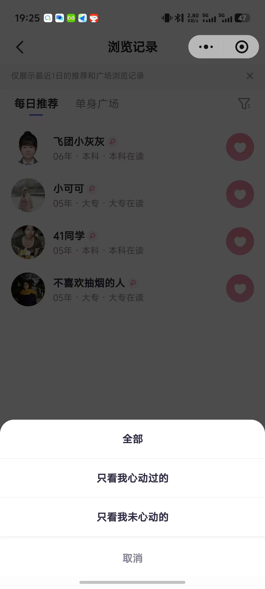

# 我看过谁与谁看过我

- **所属模块**：模块二：首页推荐与匹配
- **来源文件**：`宣誓爱终极版.xmind`
- **原节点标题**：我看过谁与谁看过我Tab切换栏： · 位于导航栏正下方 · 左侧Tab为“我看过谁”，右侧Tab为“谁看过我” · 默认选中“我看过谁”Tab，选中状态有下划线或高亮标识 · 点击Tab可切换内容区域
- **节点路径**：婚恋小程序产品功能思维导图（模块一未完成） > 模块二：首页推荐与匹配 > 我看过谁与谁看过我
- **子节点数**：2
- **子树截图数**：5

> 说明：下方按思维导图原有层级展开。带截图的节点会先展示图片，再列出该图之后挂接的要求/改动。

## 页面内容（截图 + 要求/改动）

- 我看过谁：支持重新查看1天内已滑过的用户（会员可看3天内）
  - **界面截图 1**（分为每日推荐和广场）
    
    

    - 图注/节点名：分为每日推荐和广场
  - **界面截图 2**（回看记录的筛选）
    
    

    - 图注/节点名：回看记录的筛选
- 谁看过我：显示访客列表（会员可查看详情）
  - **界面截图 3**（卡片模糊，卡片上显示距离或人气）
    
    

    - 图注/节点名：卡片模糊，卡片上显示距离或人气
    - **界面截图 4**（提示解锁会员才能查看访客）
      
      

      - 图注/节点名：提示解锁会员才能查看访客
      - **界面截图 5**（（解锁后图片变清晰，且可以点击卡片看个人主页信息）vip自动解锁所有访客记录）
        
        

        - 图注/节点名：（解锁后图片变清晰，且可以点击卡片看个人主页信息）vip自动解锁所有访客记录

## 资源

本页导出图片 5 张，目录：`images/`

- `01-分为每日推荐和广场.png`
- `02-回看记录的筛选.jpg`
- `03-卡片模糊，卡片上显示距离或人气.jpg`
- `04-提示解锁会员才能查看访客.jpg`
- `05-（解锁后图片变清晰，且可以点击卡片看个人主页信息）vip.jpg`
