# 登录与注册

- **所属模块**：模块一：注册与登录业务流程
- **来源文件**：`宣誓爱终极版.xmind`
- **节点路径**：婚恋小程序产品功能思维导图（模块一未完成） > 模块一：注册与登录业务流程 > 登录与注册
- **子节点数**：3
- **子树截图数**：19

> 说明：下方按思维导图原有层级展开。带截图的节点会先展示图片，再列出该图之后挂接的要求/改动。

## 页面内容（截图 + 要求/改动）

- **界面截图 1**（点击小程序后，直接进入登录页面，支持手机号和微信登录。若用户第一次登录：登录微信，则提示绑定手机号；若为手机号登录，提示绑定微信；若为老用户，则直接登录跳转首页。）
  
  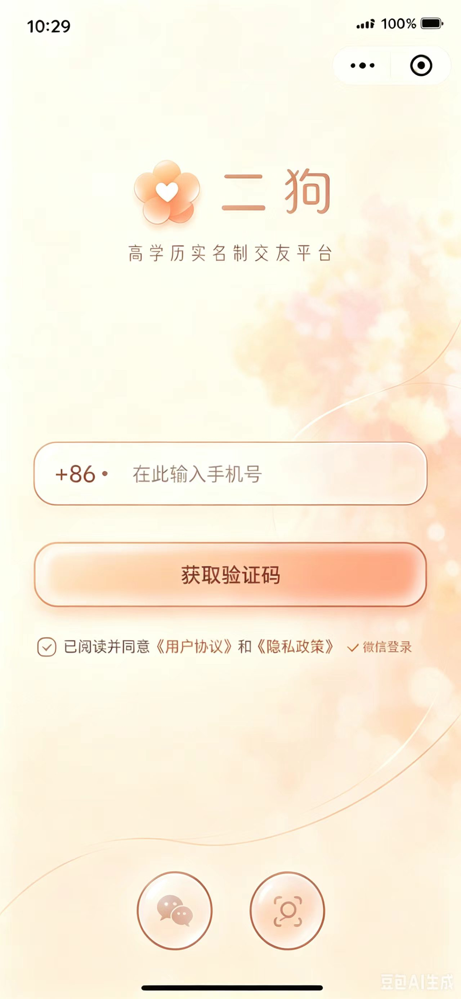

  - 图注/节点名：点击小程序后，直接进入登录页面，支持手机号和微信登录。若用户第一次登录：登录微信，则提示绑定手机号；若为手机号登录，提示绑定微信；若为老用户，则直接登录跳转首页。
- 若未完善资料，在首页的推荐页面顶部提示完善资料;主页头像下方也设有完善资料进度条；点击申请认识、在社区发评论、点赞状态、发状态都提示请完善资料
  - **界面截图 2**
    
    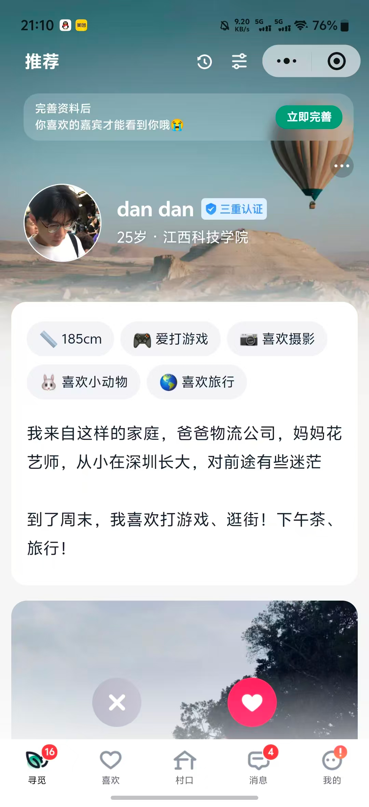

  - **界面截图 3**
    
    

- 若为新用户，登录后跳转完善资料页面
  - **界面截图 4**（选择要注册的身份（选项：自己找对象/我是父母/找搭子/当红娘））
    
    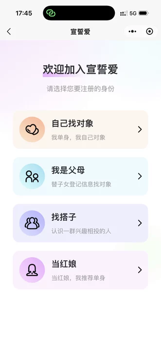

    - 图注/节点名：选择要注册的身份（选项：自己找对象/我是父母/找搭子/当红娘）
    - （自己找对象/找搭子）
      - **界面截图 5**（出生日期）
        
        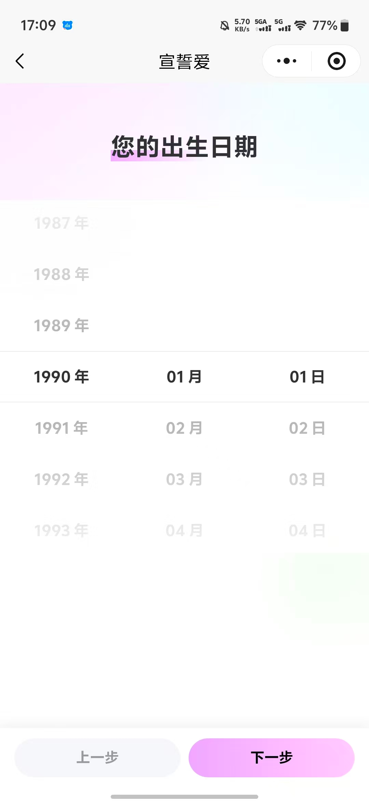

        - 图注/节点名：出生日期
        - **界面截图 6**（家乡）
          
          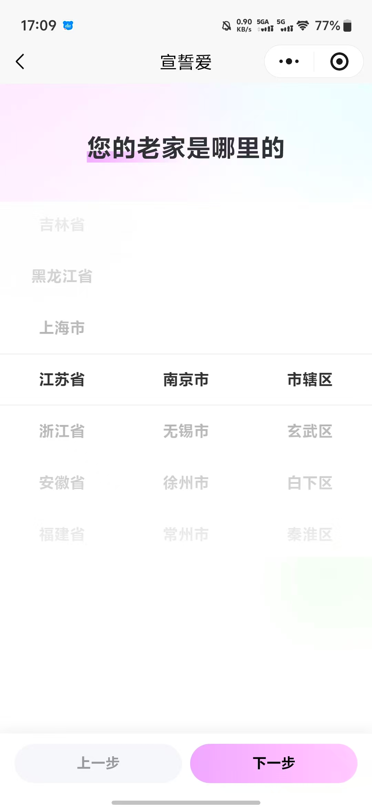

          - 图注/节点名：家乡
          - **界面截图 7**（现居地）
            
            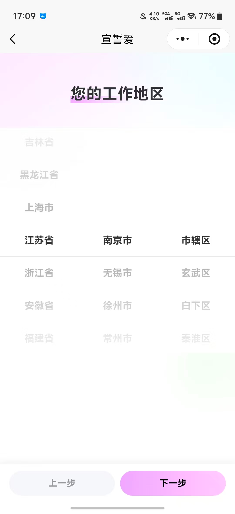

            - 图注/节点名：现居地
            - **界面截图 8**（身高）
              
              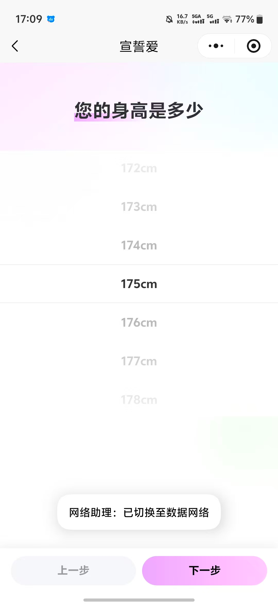

              - 图注/节点名：身高
              - **界面截图 9**（体重）
                
                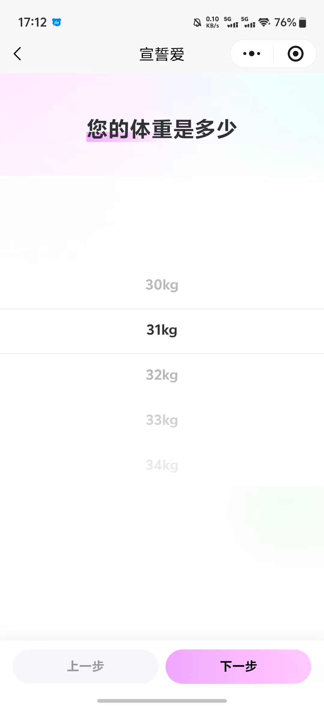

                - 图注/节点名：体重
                - **界面截图 10**（最高学历）
                  
                  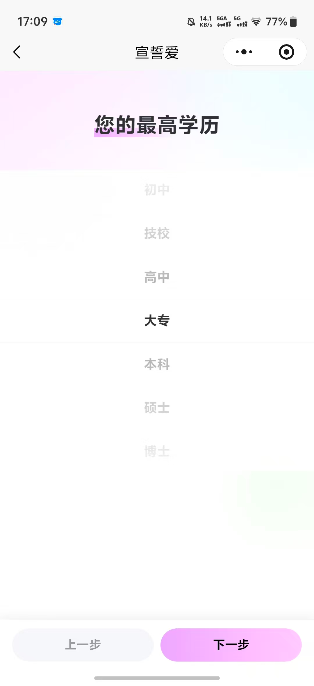

                  - 图注/节点名：最高学历
                  - **界面截图 11**（工作）
                    
                    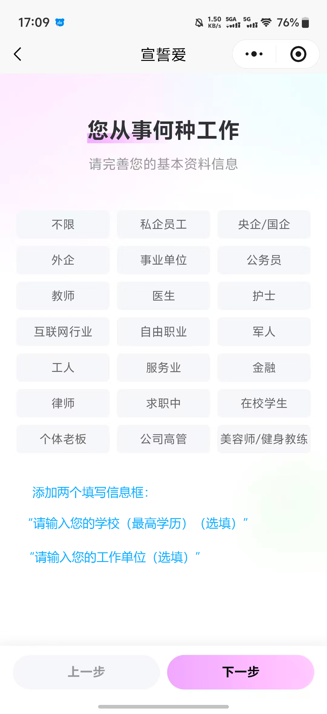

                    - 图注/节点名：工作
                    - **界面截图 12**（婚姻状况）
                      
                      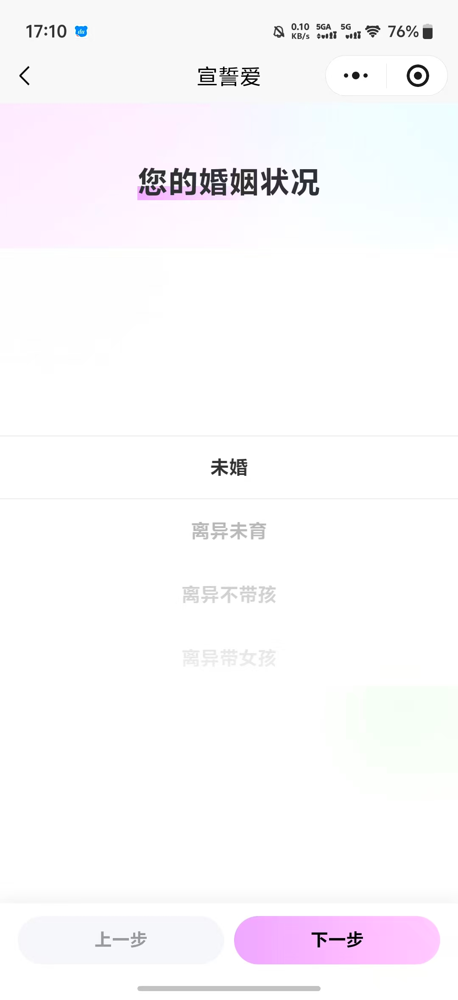

                      - 图注/节点名：婚姻状况
                      - **界面截图 13**（收入）
                        
                        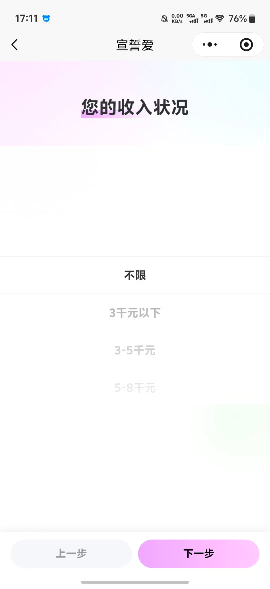

                        - 图注/节点名：收入
    - 我是父母
      - 进入父母端
    - 当红娘（点击微信，弹出二维码；点击电话，跳转手机拨号页面，可直接拨打红娘电话）
      - 推广红娘
        - **界面截图 14**（点击申请）
          
          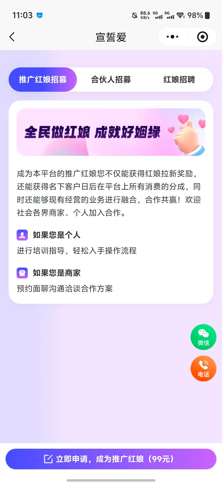

          - 图注/节点名：点击申请
          - **界面截图 15**
            
            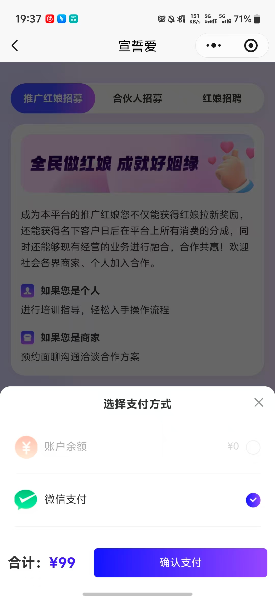

      - 合伙人招募
        - **界面截图 16**
          
          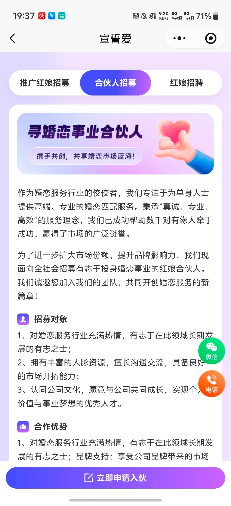

          - **界面截图 17**
            
            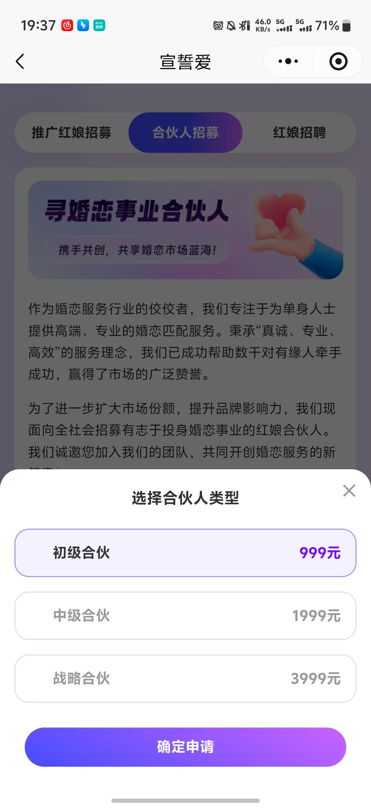

      - 红娘招聘
        - **界面截图 18**
          
          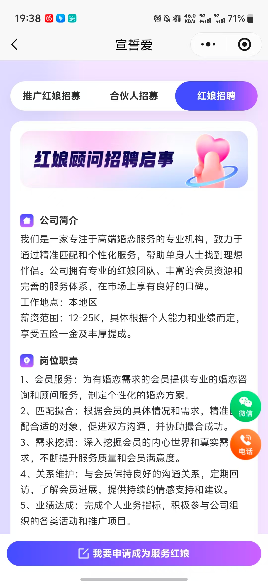

          - **界面截图 19**
            
            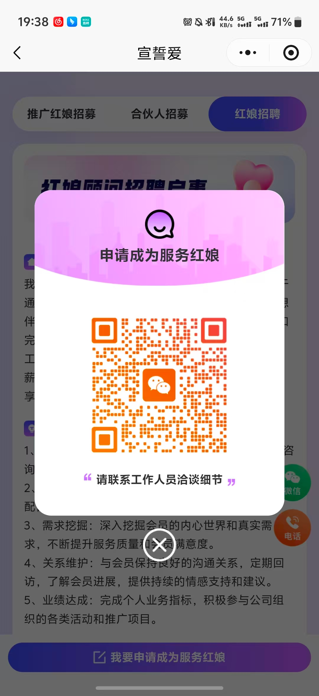

## 资源

本页导出图片 19 张，目录：`images/`

- `01-点击小程序后，直接进入登录页面，支持手机号和微信登录。若.png`
- `02-screen-02.png`
- `03-screen-03.png`
- `04-选择要注册的身份（选项.png`
- `05-出生日期.png`
- `06-家乡.png`
- `07-现居地.png`
- `08-身高.png`
- `09-体重.png`
- `10-最高学历.png`
- `11-工作.png`
- `12-婚姻状况.png`
- `13-收入.png`
- `14-点击申请.png`
- `15-screen-15.png`
- `16-screen-16.png`
- `17-screen-17.png`
- `18-screen-18.png`
- `19-screen-19.png`
