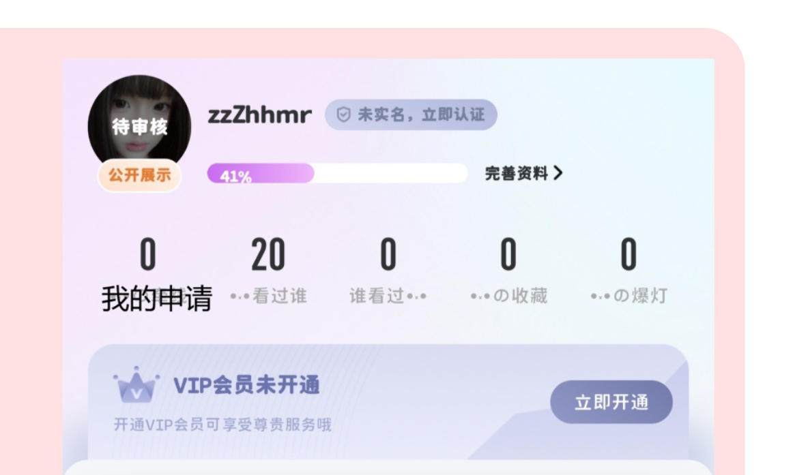
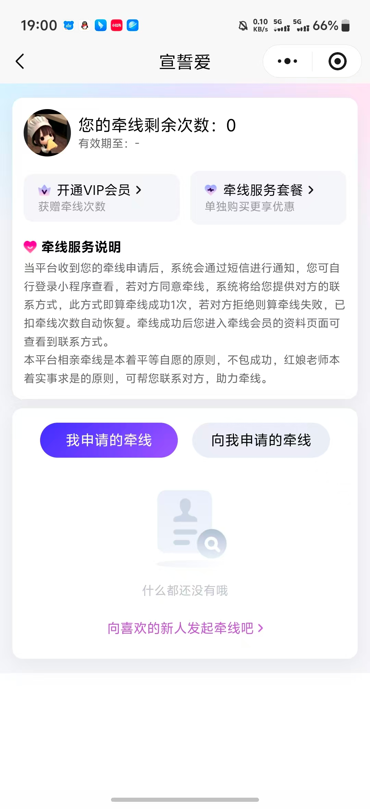
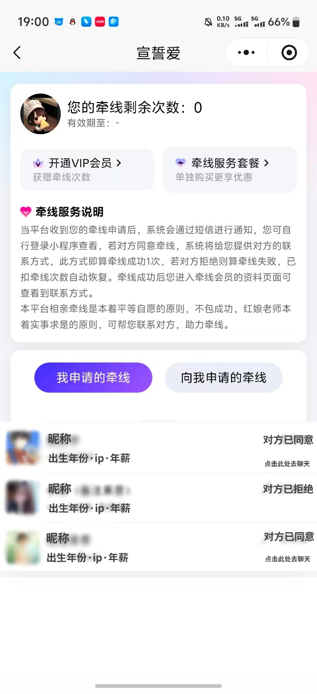
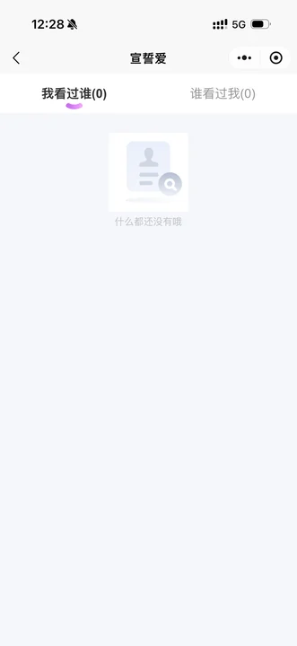
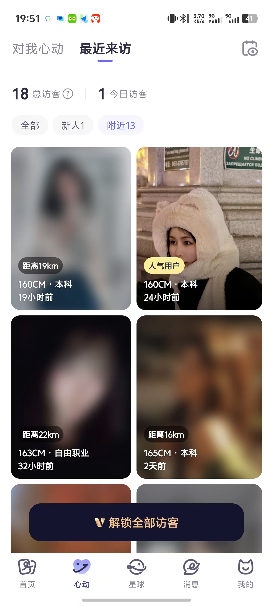
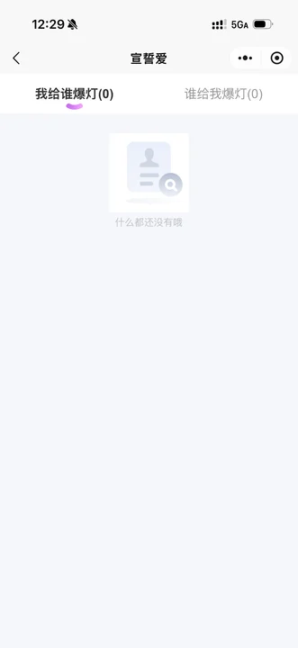

# 核心互动模块

- **所属模块**：模块一：注册与登录业务流程
- **来源文件**：`宣誓爱终极版.xmind`
- **节点路径**：婚恋小程序产品功能思维导图（模块一未完成） > 模块一：注册与登录业务流程 > 核心互动模块
- **子节点数**：6
- **子树截图数**：15

> 说明：下方按思维导图原有层级展开。带截图的节点会先展示图片，再列出该图之后挂接的要求/改动。

## 页面内容（截图 + 要求/改动）

- **界面截图 1**（核心互动模块）
  
  

  - 图注/节点名：核心互动模块
  - **界面截图 2**（点开后分为”申请我的“和”我的申请“双tab切换）
    
    

    - 图注/节点名：点开后分为”申请我的“和”我的申请“双tab切换
    - 申请我的
      - **界面截图 3**（场景一：没有收到申请）
        
        

        - 图注/节点名：场景一：没有收到申请
      - **界面截图 4**（场景二：收到申请 大致如图（头像不用模糊，显示对方头像+昵称，出生年份，ip，年薪）每个人旁边加上选项”同意/拒绝“）
        
        

        - 图注/节点名：场景二：收到申请 大致如图（头像不用模糊，显示对方头像+昵称，出生年份，ip，年薪）每个人旁边加上选项”同意/拒绝“
        - 同意申请后，跳转到和对方的聊天页面，系统自动发送“你好呀，我们可以开始聊天了~”。同时在”申请我的“页面删除对方的申请信息，对方的通知页面显示“对方已同意” `改动/要求`
        - 拒绝申请后，对方的申请认识次数+1，同时在”申请我的“页面删除对方的申请信息，对方的通知页面显示“对方已拒绝” `改动/要求`
    - 我的申请
      - **界面截图 5**（场景一：没有申请任何人）
        
        

        - 图注/节点名：场景一：没有申请任何人
        - **界面截图 6**（点击“去查看推荐”跳转到"首页推荐"）
          
          

          - 图注/节点名：点击“去查看推荐”跳转到"首页推荐"
      - **界面截图 7**（场景二：申请了其他人 大致如图（头像不用模糊，显示对方头像+昵称，出生年份，ip，年薪））
        
        

        - 图注/节点名：场景二：申请了其他人 大致如图（头像不用模糊，显示对方头像+昵称，出生年份，ip，年薪）
  - **界面截图 8**（我看过谁）
    
    

    - 图注/节点名：我看过谁
    - 我的浏览用户记录
    - 支持「我看过谁」与「谁看过我」双Tab切换，展示浏览足迹列表
  - 谁看过我
    - 支持「我看过谁」与「谁看过我」双Tab切换，展示浏览足迹列表
      - 我看过谁与谁看过我Tab切换栏： · 位于导航栏正下方 · 左侧Tab为“我看过谁”，右侧Tab为“谁看过我” · 默认选中“我看过谁”Tab，选中状态有下划线或高亮标识 · 点击Tab可切换内容区域
        - 我看过谁：支持重新查看1天内已滑过的用户（会员可看3天内）
          - **界面截图 9**（分为每日推荐和广场（在我看过谁页面内tab切换））
            
            

            - 图注/节点名：分为每日推荐和广场（在我看过谁页面内tab切换）
          - **界面截图 10**（回看记录的筛选）
            
            

            - 图注/节点名：回看记录的筛选
        - 谁看过我：显示访客列表（会员可查看详情）
          - **界面截图 11**（卡片模糊，卡片上显示距离或人气）
            
            

            - 图注/节点名：卡片模糊，卡片上显示距离或人气
            - **界面截图 12**（提示解锁会员才能查看访客）
              
              

              - 图注/节点名：提示解锁会员才能查看访客
              - **界面截图 13**（（解锁后图片变清晰，且可以点击卡片看个人主页信息）vip自动解锁所有访客记录）
                
                

                - 图注/节点名：（解锁后图片变清晰，且可以点击卡片看个人主页信息）vip自动解锁所有访客记录
    - 显示访客数量，仅vip用户点击后看查看详细访客
  - **界面截图 14**（我的收藏）
    
    

    - 图注/节点名：我的收藏
    - 显示我收藏的用户，仅自己可见
  - **界面截图 15**（我的爆灯）
    
    

    - 图注/节点名：我的爆灯
    - 支持「我给谁爆灯」与「谁给我爆灯」双Tab切换
  - 会员充值提醒
    - 可设置会员套餐

## 要求与改动摘要

从本页子树中提取的、带明确要求/改动语义的节点：

- 申请我的 / 场景二：收到申请 大致如图（头像不用模糊，显示对方头像+昵称，出生年份，ip，年薪）每个人旁边加上选项”同意/拒绝“ / 同意申请后，跳转到和对方的聊天页面，系统自动发送“你好呀，我们可以开始聊天了~”。同时在”申请我的“页面删除对方的申请信息，对方的通知页面显示“对方已同意”
- 申请我的 / 场景二：收到申请 大致如图（头像不用模糊，显示对方头像+昵称，出生年份，ip，年薪）每个人旁边加上选项”同意/拒绝“ / 拒绝申请后，对方的申请认识次数+1，同时在”申请我的“页面删除对方的申请信息，对方的通知页面显示“对方已拒绝”

## 资源

本页导出图片 15 张，目录：`images/`

- `01-核心互动模块.png`
- `02-点开后分为”申请我的“和”我的申请“双tab切换.png`
- `03-场景一：没有收到申请.png`
- `04-场景二.png`
- `05-场景一：没有申请任何人.png`
- `06-点击“去查看推荐”跳转到-首页推荐.png`
- `07-场景二.png`
- `08-我看过谁.png`
- `09-分为每日推荐和广场（在我看过谁页面内tab切换）.png`
- `10-回看记录的筛选.jpg`
- `11-卡片模糊，卡片上显示距离或人气.jpg`
- `12-提示解锁会员才能查看访客.jpg`
- `13-（解锁后图片变清晰，且可以点击卡片看个人主页信息）vip.jpg`
- `14-我的收藏.png`
- `15-我的爆灯.png`
