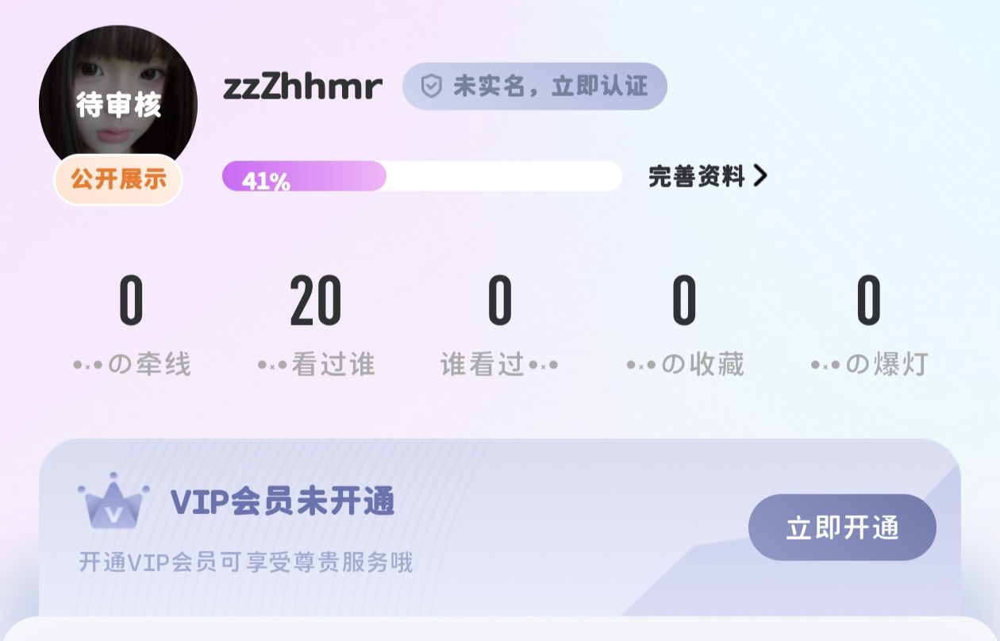
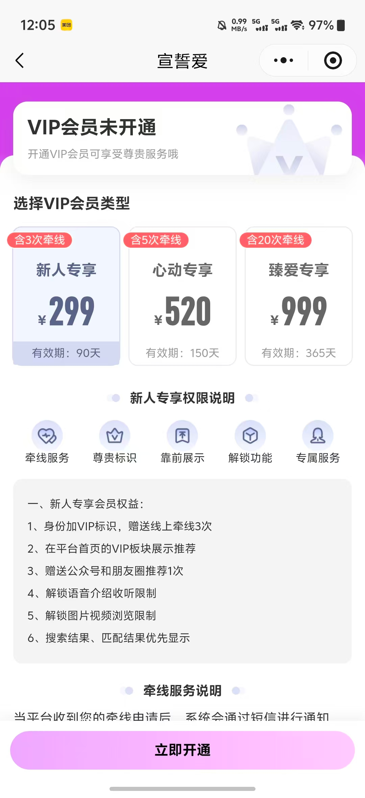
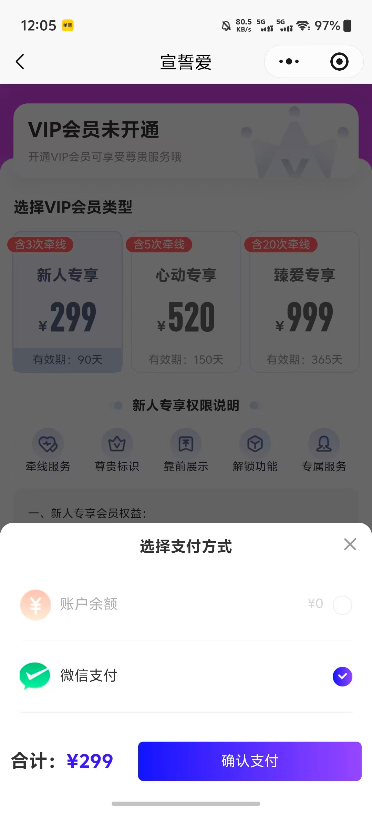
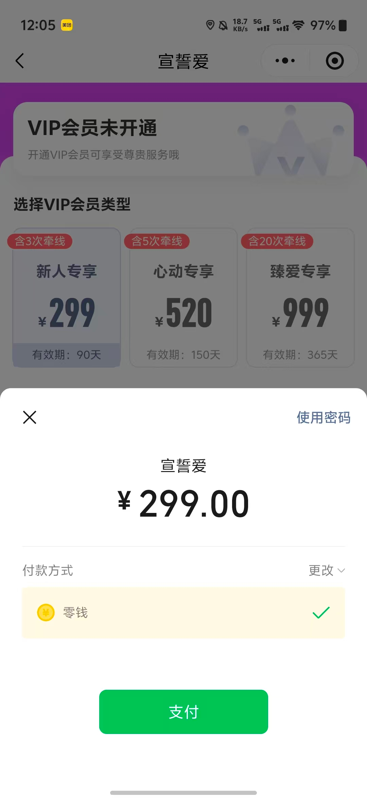
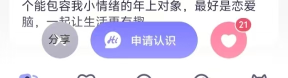
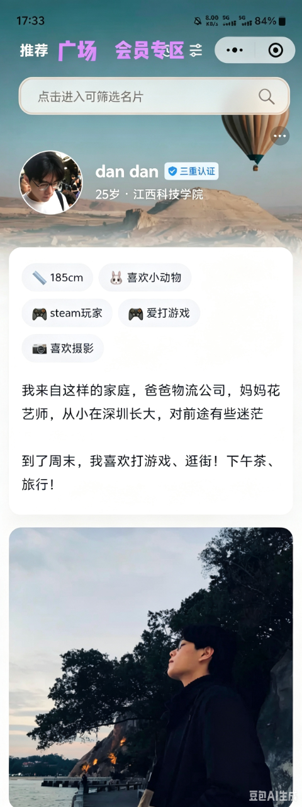

# 会员体系

- **所属模块**：模块五：会员、支付与任务留存
- **来源文件**：`宣誓爱终极版.xmind`
- **节点路径**：婚恋小程序产品功能思维导图（模块一未完成） > 模块五：会员、支付与任务留存 > 会员体系
- **子节点数**：2
- **子树截图数**：9

> 说明：下方按思维导图原有层级展开。带截图的节点会先展示图片，再列出该图之后挂接的要求/改动。

## 页面内容（截图 + 要求/改动）

- 多等级套餐（月卡、季卡、年卡，价格待定） `改动/要求`
  - 会员充值入口
    - **界面截图 1**（点击我的进入个人中心页面）
      
      

      - 图注/节点名：点击我的进入个人中心页面
      - **界面截图 2**（点击立即开通）
        
        

        - 图注/节点名：点击立即开通
        - **界面截图 3**
          
          

          - **界面截图 4**（点击立即开通）
            
            

            - 图注/节点名：点击立即开通
            - **界面截图 5**（支付后充值成功）
              
              

              - 图注/节点名：支付后充值成功
              - 主页和个人中心头像旁显示vip标识
- 核心权益：
  - 增加申请次数 `改动/要求`
    - 普通用户每天限制免费“申请认识”3次，升级会员后可增加为7次（具体几次可后续商定） `改动/要求`
      - **界面截图 6**（点击个人名片下方申请认识后）
        
        

        - 图注/节点名：点击个人名片下方申请认识后
        - 弹出是否申请框，选项下方显示今日剩余申请次数，每日申请次数刷新，剩余申请次数不可叠加
  - 无痕浏览
    - 普通用户查看名片和主页时会留下访客痕迹，vip可开启无痕浏览
      - **界面截图 7**（点击我的进入个人中心页面）
        
        

        - 图注/节点名：点击我的进入个人中心页面
        - 找到设置
          - 隐私设置
            - **界面截图 8**（无痕浏览开关按键，仅会员可开，若普通用户开启，则跳出提示弹窗，引导用户开通会员，点击立即开通按钮，则进入会员套餐开通页面）
              
              

              - 图注/节点名：无痕浏览开关按键，仅会员可开，若普通用户开启，则跳出提示弹窗，引导用户开通会员，点击立即开通按钮，则进入会员套餐开通页面
  - 优先曝光（推荐权重提升）
    - 优先给用户推荐，且可以单独出现在首页的会员专区
  - 高级筛选（全部条件）
    - **界面截图 9**（点击首页筛选框，直接进入筛选页面）
      
      

      - 图注/节点名：点击首页筛选框，直接进入筛选页面
      - 筛选搜索框
        - 基础筛选（城市、年龄、学历）
        - 高级筛选（收入、MBTI、兴趣标签、择偶要求），设为VIP权益
        - mbti匹配功能入口
  - 查看“谁看过我”详细列表
  - 专属VIP标识（头像上展示）

## 要求与改动摘要

从本页子树中提取的、带明确要求/改动语义的节点：

- 会员体系 / 多等级套餐（月卡、季卡、年卡，价格待定）
- 会员体系 / 核心权益： / 增加申请次数
- 核心权益： / 增加申请次数 / 普通用户每天限制免费“申请认识”3次，升级会员后可增加为7次（具体几次可后续商定）

## 资源

本页导出图片 9 张，目录：`images/`

- `01-点击我的进入个人中心页面.png`
- `02-点击立即开通.png`
- `03-screen-03.png`
- `04-点击立即开通.png`
- `05-支付后充值成功.png`
- `06-点击个人名片下方申请认识后.png`
- `07-点击我的进入个人中心页面.png`
- `08-无痕浏览开关按键，仅会员可开，若普通用户开启，则跳出提示.png`
- `09-点击首页筛选框，直接进入筛选页面.png`
