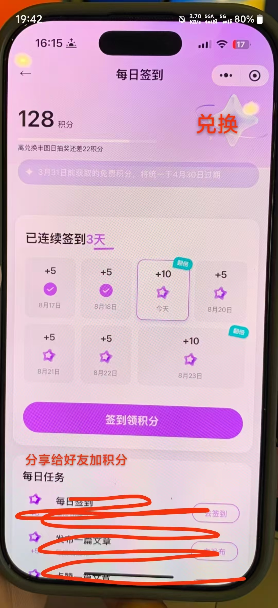
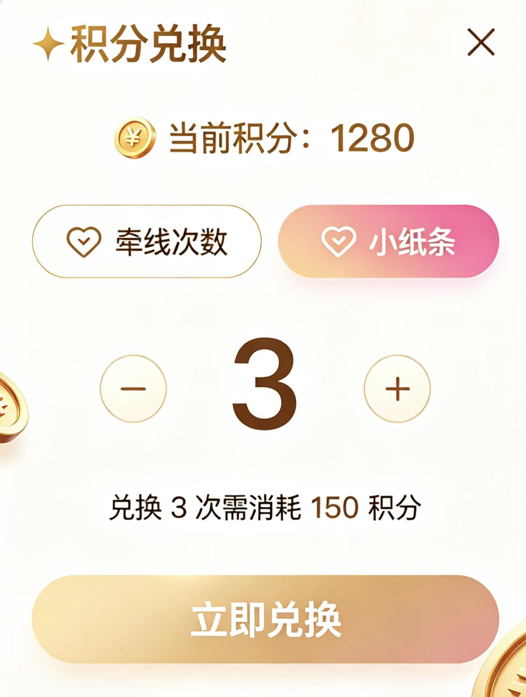

# 虚拟货币（积分）

- **所属模块**：模块五：会员、支付与任务留存
- **来源文件**：`宣誓爱终极版.xmind`
- **节点路径**：婚恋小程序产品功能思维导图（模块一未完成） > 模块五：会员、支付与任务留存 > 虚拟货币（积分）
- **子节点数**：2
- **子树截图数**：3

> 说明：下方按思维导图原有层级展开。带截图的节点会先展示图片，再列出该图之后挂接的要求/改动。

## 页面内容（截图 + 要求/改动）

- 获取途径：签到、邀请好友
  - 点击“我的”选择“我的任务”
    - **界面截图 1**
      
      

      - 点击“签到领积分”，显示“签到成功，积分+1”
      - （空节点）
      - 邀请好友
- 用途：兑换申请次数，纸飞机，解锁筛选后的照片
  - **界面截图 2**（点击“兑换”，弹出兑换窗口）
    
    

    - 图注/节点名：点击“兑换”，弹出兑换窗口
    - **界面截图 3**
      
      

## 资源

本页导出图片 3 张，目录：`images/`

- `01-screen-01.png`
- `02-点击“兑换”，弹出兑换窗口.png`
- `03-screen-03.png`
